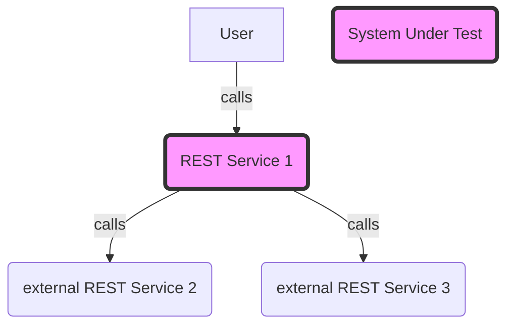
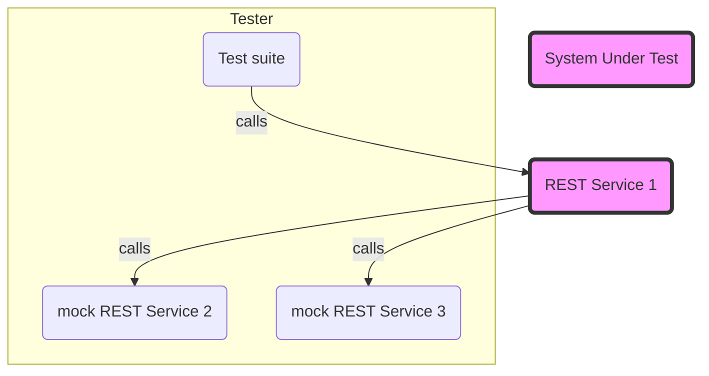

Tester is a REST MicroService data-driven testing framework. It allows testers to create test suites to test REST microservices while mocking external dependencies. Tests suites and mock servers created in `yaml` format.

# Usage

Let's say you are testing a microservice that looks like this:


Tester allows you to create test suites and mock servers to test your REST service like this:


# Examples
In its simplest form, `tester` can be used like `curl` as an HTTP client in the command line:
```
$ tester https://api.publicapis.org/random
```
Or to load test specifying 1000 concurrent HTTP POST requests:
```
$ tester -P 1000 -m POST https://api.publicapis.org/random
```

A simple mock HTTP server listening on port 1234 can be started using:
```
$ tester -s -p 1234
```

More complex scenarios can be defined using `yaml` files. For example:
```
$ tester -f src/main/resources/example1.yaml
```

Bigger test suites can be defined by recursively loading all `.yaml` files from a folder:
```
$ tester -f src/main/resources
```


# Dev mode
For developers, tester can be started in dev mode using the following command:

```
export QUARKUS_ARGS="-f src/test/resources/example1.yaml"
OR 
./mvnw quarkus:dev -Dquarkus.args="-f src/test/resources/example1.yaml"
```